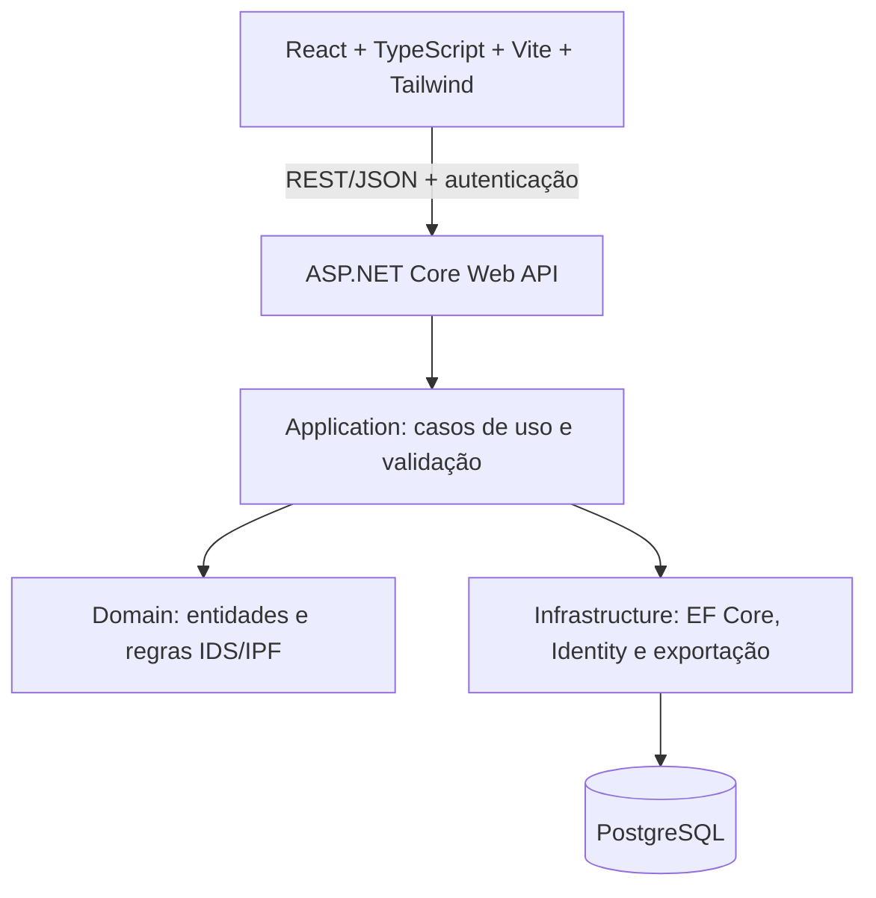

# Plano do Sistema IDS

**Status:** análise concluída; implementação inicial em andamento por fases.  
**Fonte analisada:** `IDS-MD-R06-modelo.xlsx` (454.000 bytes).  
**Prioridade:** preservar a regra observável do Excel e não resolver ambiguidades por suposição.

## Estado da implementação

Implementado: API ASP.NET Core em camadas, cálculo diário de IDS no domínio, entidades normalizadas, Identity/JWT, migrations PostgreSQL, catálogo sementeado, criação/consulta/edição/envio de avaliações, health check, dashboard, aba Dados com consolidação por data/categoria/item/severidade, entrada mensal manual de IPF com histórico e média anual dos meses registrados, frontend responsivo e Compose. A migration `AddMonthlyIpfHistory` foi aplicada ao PostgreSQL local. Os testes cobrem domínio, Application e API; o build completo passa.

Ainda pendentes: validação do IDS mensal e do agrupamento semanal, comparação com avaliação real do Excel, geração PDF/Excel, importação histórica, auditoria completa, isolamento multiempresa por usuário, testes de integração com PostgreSQL real, TLS/segredos de produção e atualização de .NET 9 para .NET 10 LTS. O IPF permanece manual; não há fórmula de cálculo no workbook.

## 1. Resumo da análise

A pasta contém 33 abas: 30 formulários diários (cinco semanas, de segunda a sábado), uma consolidação chamada `Dados`, uma entrada de relatório chamada `Dados Relatório Mensal` e o documento `Relatório IPF`. Há 14 gráficos, dois deles de barras 3D. Não foram encontrados dados de avaliação preenchidos que permitam reproduzir um resultado real. Os valores em cache são em sua maioria zero, `-` ou referências vazias; há erros `#DIV/0!` em cálculos sem dados.

O arquivo é um modelo de 2025: a série mensal usa datas de janeiro a dezembro de 2025. A estrutura não contém tabelas Excel, tabelas dinâmicas ou vínculos externos. As fórmulas ligam as 30 abas diárias às abas de consolidação e relatório.

| Grupo | Abas | Finalidade observada |
|---|---|---|
| Semana 1 | `seg (1)`, `ter (1)`, `qua (1)`, `qui (1)`, `sex (1)`, `sab (1)` | Entradas diárias e cálculos de IDS |
| Semana 2 | `seg (2)`, `ter (2)`, `qua (2)`, `qui (2)`, `sex (2)`, `sab (2)` | Entradas diárias e cálculos de IDS |
| Semana 3 | `seg (3)`, `ter (3)`, `qua (3)`, `qui (3)`, `sex (3)`, `sab (3)` | Entradas diárias e cálculos de IDS |
| Semana 4 | `seg (4)`, `ter (4)`, `qua (4)`, `qui (4)`, `sex (4)`, `sab (4)` | Entradas diárias e cálculos de IDS |
| Semana 5 | `seg (5)`, `ter (5)`, `qua (5)`, `qui (5)`, `sex (5)`, `sab (5)` | Entradas diárias e cálculos de IDS; pode ser marcada como não aplicável |
| Consolidação | `Dados` | Médias, totais, contagens por gravidade/categoria e dados para gráficos |
| Dados do relatório | `Dados Relatório Mensal` | Metadados do relatório e séries históricas mensais de IPF e IDS |
| Relatório | `Relatório IPF` | Saída imprimível com resultados, meta, status e gráficos |

### Volume de fórmulas

O pacote contém 2.107 nós de fórmula; 1.563 nós têm texto de fórmula explícito e os demais incluem seguidores de fórmulas compartilhadas do formato XLSX. A distribuição por aba é: 1.634 nós nas abas diárias, 456 em `Dados`, 3 em `Dados Relatório Mensal` e 14 em `Relatório IPF`.

Funções identificadas no texto das fórmulas: `IF` (664 ocorrências), `SUMIF` (540), `COUNT` (480), `SUM` (462), `AVERAGE` (5) e `IFERROR` (3). As contagens são ocorrências, não fórmulas únicas; uma fórmula pode conter mais de uma função. As fórmulas compartilhadas foram consideradas por suas células de origem e seus intervalos, sem enumerar cópias traduzidas uma a uma.

## 2. Entradas, cálculos e saídas da planilha

### Formulário diário

Cada formulário tem metadados da avaliação: local/projeto, contratada, subcontratada, acompanhante, auditor líder, auditor, data, hora e número de pessoas observadas. A nomenclatura exata de alguns campos e o vínculo entre `Local` e projeto precisam ser preservados na primeira modelagem e confirmados com os usuários.

Os 32 itens observáveis estão organizados em seis categorias. Para cada item são usados quantidade (coluna C), peso/severidade (coluna D) e comentário (coluna E):

| Categoria | Itens | Linhas do formulário |
|---|---:|---|
| Uso de EPIs | 9 | 8–16 |
| Posição das pessoas | 10 | 19–28 |
| Ação quando observado | 4 | 31–34 |
| Procedimentos | 3 | 37–39 |
| Ferramentas e equipamentos | 3 | 42–44 |
| Padrões de organização | 3 | 47–49 |

Há também campos textuais para pontos fortes e oportunidades de melhoria. O peso é selecionado de uma lista com `0,3`, `1` e `3` (valores em `A77:A79`). A única validação de dados observada em cada aba diária é essa lista, aplicada às células de peso dos seis grupos. Quantidade, número de pessoas e campos de cabeçalho não têm validação Excel equivalente.

### Fórmulas do formulário diário

As fórmulas abaixo são o padrão da aba-base `seg (1)` e se repetem nas outras abas diárias, com os vínculos entre dias/semanas conforme descrito em “Consolidação”. As fórmulas armazenadas no XLSX usam nomes de função em inglês.

| Células | Fórmula/regra observada | Regra de negócio candidata |
|---|---|---|
| `I8:I16`, `I19:I28`, `I31:I34`, `I37:I39`, `I42:I44`, `I47:I49` | `IF(COUNT(Cn:Dn)=1, aviso, "-")` | Exibir alerta quando exatamente um entre quantidade e peso for numérico. Dois campos vazios não geram alerta. |
| `C17`, `C29`, `C35`, `C40`, `C45`, `C50` | `SUM` sobre quantidades dos respectivos itens | Subtotal de quantidade por grupo; não pondera pela severidade. |
| `C53:C55` | Soma de seis `SUMIF` por gravidade (`0,3`, `1`, `3`), um por grupo | Contar quantidade de desvios classificada em cada severidade. |
| `F53:F55` | `IF(Cn>0,Cn/$C$56,"-")` | Fração de desvios de cada severidade sobre o total de desvios. |
| `C56` | `SUM(C53:E55)` | Total de desvios `Q`. A soma inclui a área C:E; células não numéricas são ignoradas por `SUM`. |
| `F56` | `SUM(F53:H55)` | Total das frações de severidade; a planilha não documenta validação explícita de que seja 100%. |
| `F58` | `=C56` | `Q`: total de desvios. |
| `F59` | `=H5` | `N`: pessoas observadas. |
| `F60` | `(C53*A53)+(C54*A54)+(C55*A55)` | `SD`: soma da quantidade de desvios multiplicada por sua severidade. |
| `F62` | `IF(F59>0,1-(F60/F59),"-")` | `IDS = 1 - (SD/N)`, exibido em formato percentual. |

Os pesos são decimais e `F62` usa formato percentual (`0,0%` no estilo identificado). Portanto, o valor numérico da nota é uma fração (por exemplo, `0,84` representa `84%`), não uma escala numérica de 0 a 10.

### Consolidação `Dados`

`Dados` tem fórmulas nas seguintes linhas/colunas; as lacunas de linha correspondem a títulos ou rótulos. Este inventário cobre os endereços de fórmula de toda a aba:

| Endereços | Uso e padrão |
|---|---|
| `I2`, `I11`, `I21`, `I30`, `I36`, `I41`, `I50`, `I57`, `I69`, `I82`, `I88`, `I94` | Marcador de aplicabilidade da semana 5 e propagação do marcador aos blocos. `I2` testa `IF('seg (5)'!F3="n/a","w5 não aplicável")`. |
| `A3:A8` | Indicador auxiliar `IF(Cn=0%,0,1)`; o propósito não está demonstrado por outra fórmula ou referência dos gráficos. |
| `C3:H8`, `C9:H9` | IDS diário por semana, média por dia da semana e médias semanais/mensal. Exemplo: `C3=IFERROR(AVERAGE(D3:H3),"-")`; `D3:H8` referenciam `F62` das avaliações. `D9:H9` calculam médias por semana; `C9` é a média geral sobre essas médias. |
| `C12:H18` | Total de pessoas observadas por dia/semana e totais semanais. As fontes diárias são `H5`. A coluna H é condicionada à aplicabilidade da semana 5. |
| `C22:H28` | Total de desvios por dia/semana e totais semanais. As fontes diárias são `C56`. |
| `C31:H34` | Contagens por gravidade (baixo/médio/alto) e totais, a partir de `C53:C55` das 30 abas diárias. |
| `C37:H39` | Fração de cada gravidade sobre o total, por consolidação e semana. Exemplo: `D37=D31/D34`; não há proteção contra denominador zero. |
| `C42:H48` | Total por seis categorias e total geral. |
| `C51:H55` | Quantidade por cada uma das quatro ações e total. |
| `C58:H67` | Quantidade por cada um dos nove itens de EPI e total. |
| `C70:H80` | Quantidade por cada um dos dez riscos de posição e total. |
| `C83:H86` | Quantidade por cada um dos três itens de ferramentas/equipamentos e total. |
| `C89:H92` | Quantidade por cada um dos três itens de procedimentos e total. |
| `C95:H98` | Quantidade por cada um dos três itens de organização e total. |

Nas matrizes acima, `D:H` representa semanas 1–5; em geral, os valores semanais somam as seis abas diárias da semana. `C` consolida as semanas. As linhas de total somam as linhas precedentes. As células `H` das consolidações usam `IF` para retornar `-` quando `I2` indica que a quinta semana não se aplica.

Padrões de fórmula que cobrem as células dessas matrizes:

| Intervalo/células | Fórmula Excel/padrão de referências |
|---|---|
| `C3:C8` | `IFERROR(AVERAGE(Dn:Hn),"-")`; `D3:H8` ligam cada dia da semana à célula `F62` das cinco avaliações daquele dia. |
| `D9:H9` | `IFERROR(AVERAGE(D3:D8),"-")` transladada por coluna; `C9` usa a mesma média horizontal sobre `D9:H9`. |
| `C12:C17`, `C22:C27`, `C43:C47`, `C51:C54`, `C58:C66`, `C70:C79`, `C83:C85`, `C89:C91`, `C95:C97` | `SUM(Dn:Hn)` para total da linha entre semanas. `C42` é exceção e soma `Dados!$D$67:$H$67`. |
| `D12:G17` | Liga cada dia às células `H5` das seis avaliações da semana; `H12:H17` usa `IF(I2="w5 não aplicável","-", referência a H5 da semana 5)`. |
| `D22:G27` | Soma, para o dia/semana correspondente, `C56` das seis avaliações; `H22:H27` usa a mesma regra condicional da semana 5. |
| `C18:H18`, `C28:H28`, `C34:H34`, `C48:H48`, `C55:H55`, `C67:H67`, `C80:H80`, `C86:H86`, `C92:H92`, `C98:H98` | `SUM` das linhas do bloco precedente ou das semanas; totais de quinta semana são condicionados ao marcador `I2`. |
| `D31:G33` | Para cada gravidade, soma a célula diária `C53`, `C54` ou `C55` nas seis avaliações da semana; coluna H condicionada à semana 5. `C31:C33=SUM(Dn:Hn)`. |
| `C37:H39` | Fração de gravidade por total: exemplo `C37=C31/C34`, `D37=D31/D34`; transladado para as três gravidades/semanas, sem `IFERROR`. |
| `D42:G47` | Totais por categoria derivados dos totais semanais dos blocos item: EPI `D67`, posição `D80`, ações `D55`, procedimentos `D92`, ferramentas `D86`, organização `D98`; coluna H condicional. `C42=SUM(Dados!$D$67:$H$67)`; demais totais de categoria consolidam suas semanas. |
| `D51:G54` | Para cada ação, soma `C31:C34` de segunda a sábado na semana; total da categoria na linha 55. |
| `D58:G66`, `D70:G79`, `D83:G85`, `D89:G91`, `D95:G97` | Para cada item, soma a célula de quantidade correspondente nas seis avaliações diárias; a origem é, respectivamente, `C8:C16`, `C19:C28`, `C42:C44`, `C37:C39` e `C47:C49`; coluna H condicional. |
| `I2` e demais marcadores I listados acima | `I2=IF('seg (5)'!F3="n/a","w5 não aplicável")`; os demais marcadores são `=I2`. |

As fórmulas de `D:G` nas matrizes semanais são expansões do mesmo padrão para os cinco dias úteis/seis dias observados e não são independentes entre si. Os intervalos listados acima, junto das exceções documentadas, descrevem todas as áreas com nós de fórmula em `Dados`.

### `Dados Relatório Mensal` e `Relatório IPF`

`Dados Relatório Mensal` contém campos de projeto/ilha, site, cliente, contratada, disciplina, mês/ano, avaliador e emissão. A série fixa cobre 12 meses de 2025:

| Células | Origem/regra observada |
|---|---|
| `C15:C26` | Entradas para resultados anteriores de IPF (sem fórmulas observadas). |
| `C27` | Entrada do resultado IPF do mês de referência (sem fórmula observada). |
| `C28` | `AVERAGE(C15:C26)`: média anual de IPF anterior. |
| `C31:C42` | Entradas para resultados anteriores de IDS (sem fórmulas observadas). |
| `C43` | `=Dados!C9`: IDS do mês de referência calculado na consolidação. |
| `C44` | `AVERAGE(C31:C42)`: média anual de IDS anterior. |

O relatório IPF declara que a referência mínima é “acima de 7” e que resultado abaixo de 7 exige plano de ação. `D20` recebe o IPF em `C27`; `F20` usa `IF(D20>7, status OK, status abaixo da meta)`. `D72` recebe o IDS em `C43`; `F72` também usa `IF(D72>7, ...)`. O IPF atual é informado manualmente; não há fórmula de cálculo de IPF no arquivo.

Fórmulas presentes em `Relatório IPF` (as referências diretas alimentam campos de identificação e emissão; não recalculam indicadores):

| Célula | Fórmula | Finalidade observada |
|---|---|---|
| `A3` | `='Dados Relatório Mensal'!C3` | Projeto/ilha |
| `A4` | `='Dados Relatório Mensal'!C5` | Cliente |
| `A5` | `='Dados Relatório Mensal'!C4` | Local do site |
| `A7` | `='Dados Relatório Mensal'!C6` | Contratada |
| `A8` | `='Dados Relatório Mensal'!C7` | Disciplina |
| `A9`, `B9` | `='Dados Relatório Mensal'!B9`; `='Dados Relatório Mensal'!C9` | Rótulo e nome do avaliador |
| `A10`, `B10` | `='Dados Relatório Mensal'!B10`; `='Dados Relatório Mensal'!C10` | Rótulo e data de emissão |
| `I10` | `='Dados Relatório Mensal'!C8` | Período do relatório |
| `D20` | `='Dados Relatório Mensal'!C27` | IPF do mês de referência |
| `F20` | `IF(D20>7,"[Ok - Meta Alcançada]","[Resultado Abaixo da Meta]")` | Status do IPF |
| `D72` | `='Dados Relatório Mensal'!C43` | IDS do mês de referência |
| `F72` | `IF(D72>7,"[Ok - Meta Alcançada]","[Resultado Abaixo da Meta]")` | Status do IDS; unidade/meta precisam ser validadas |

`Dados Relatório Mensal` contém somente as três fórmulas `C28`, `C43` e `C44` documentadas acima; os demais resultados mensais nesse bloco são entradas manuais.

### Gráficos

Os títulos não estão gravados como texto nas partes XML dos gráficos; os tipos e referências de séries são verificáveis. Há dois gráficos 3D e 12 gráficos de barras:

| Gráfico | Tipo | Dados referenciados | Leitura funcional |
|---|---|---|---|
| 1 | Barras 3D | `Dados Relatório Mensal!B31:C42` e `B44:C44` | Histórico mensal de IDS e média anual |
| 2 | Barras 3D | `Dados Relatório Mensal!B15:C28` | Histórico mensal de IPF e média anual |
| 3 | Barras | `Dados!B3:B9`, `C2:H2`, `C3:H9` | IDS por dia da semana e médias |
| 4 | Barras | `Dados!B12:B18`, cabeçalho semanal e totais | Pessoas observadas por dia/semana |
| 5 | Barras | `Dados!B22:B28`, cabeçalho semanal e totais | Desvios por dia/semana |
| 6 | Barras | `Dados!B31:B34`, semanas D:H | Contagem por gravidade |
| 7 | Barras | `Dados!B37:B39`, semanas D:H | Percentual por gravidade |
| 8 | Barras | `Dados!B58:B67`, semanas D:H | Detalhamento de EPIs |
| 9 | Barras | `Dados!B70:B80`, semanas D:H | Detalhamento de posição/riscos |
| 10 | Barras | `Dados!B51:B55`, semanas D:H | Ações observadas |
| 11 | Barras | `Dados!B89:B92`, semanas D:H | Procedimentos |
| 12 | Barras | `Dados!B83:B86`, semanas D:H | Ferramentas/equipamentos |
| 13 | Barras | `Dados!B95:B98`, semanas D:H | Organização |
| 14 | Barras | `Dados!B42:B48`, semanas D:H | Consolidação por categoria |

## 3. Regras de negócio e pontos não inferíveis

| Fórmula Excel | Regra candidata no sistema | Entidade/dados | Serviço/API/tela | Estado |
|---|---|---|---|---|
| `COUNT(Cn:Dn)=1` e somas de grupo | Validar o par quantidade/peso e totalizar quantidades por categoria | Avaliação e respostas por item | Validação da avaliação; `POST/PUT /api/evaluations`; formulário de avaliação | A fórmula do alerta é conhecida; obrigatoriedade e faixas de quantidade precisam de decisão |
| `SUMIF` por pesos `0,3`, `1`, `3` | Classificar a quantidade informada por severidade e obter subtotais | Resposta de avaliação, item e severidade | Serviço de cálculo IDS; resposta da avaliação e indicadores | Regra observada |
| `SD = Σ(contagem × peso)` e `IDS = 1 - SD/N` | Calcular IDS como fração e apresentar como percentual; quando `N <= 0`, a planilha mostra `-` | Avaliação, pessoas observadas e respostas | `GET /api/evaluations/{id}/indicators`; detalhe da avaliação | Fórmula observada; arredondamento de persistência/apresentação a confirmar |
| `AVERAGE` e `SUM` de `Dados` | Consolidar observações em semana/mês e calcular médias | Avaliações datadas e período de reporte | Serviço de consolidação; `GET /api/reports/weekly` e `/monthly` | A fórmula aritmética é conhecida; definição de semana é **REGRA A VALIDAR** |
| `C28=AVERAGE(C15:C26)`, `C44=AVERAGE(C31:C42)` | Calcular média dos 12 valores mensais anteriores de IPF/IDS | Histórico mensal de indicadores | Serviço e API de relatório mensal | A média é observável; tratamento de meses sem dado é **REGRA A VALIDAR** |
| `IF(resultado>7,...)` | Classificar meta e exibir status | Indicador e meta | Serviço de relatório; `GET /api/reports/monthly/{period}` | Para IPF, aparenta escala de 0–10; para IDS, conflito de unidade é **REGRA A VALIDAR** |
| Campos históricos sem fórmula | Preservar resultados de IPF/IDS fornecidos manualmente quando não houver avaliações detalhadas de origem | Histórico de indicador/importação | Importação posterior; formulário de relatório mensal | **REGRA A VALIDAR:** fonte e precedência entre dado importado e cálculo do sistema |

Não se deve criar um cálculo de IPF: a planilha só prevê entrada manual do valor atual e da série histórica. Também não é possível concluir como semanas do calendário são atribuídas a `S1`–`S5`, se domingo é excluído deliberadamente, como meses parciais são tratados ou se a média mensal deve ignorar dias sem avaliação.

## 4. Riscos e validações necessárias

1. **Meta de IDS incompatível com a unidade aparente.** `F62` produz uma fração formatada como percentual; `F72` testa `IDS > 7`. Um IDS percentual normal fica entre 0 e 1 como número. No cache do modelo vazio, `D72` é `-` e o status armazenado é “Ok - Meta Alcançada”, indício de comparação de texto com número no Excel. Confirmar a escala e o operador da meta antes de converter.
2. **Semana 5 controlada pelo campo de auditor.** `Dados!I2` testa se `seg (5)!F3` é `n/a`; `F3` é o campo Auditor no formulário. Confirmar se esse é realmente o marcador para semana não aplicável.
3. **Fórmulas ausentes em duas abas diárias.** `qui (2)!C56` não tem fórmula, embora as demais abas tenham `SUM(C53:E55)`. Isso afeta o total de desvios e percentuais da aba. `sex (2)` não tem os cinco vínculos de metadados `B2`, `F2`, `B3`, `B4` e `B5` presentes em outras abas. Não corrigir silenciosamente; comparar com uma cópia de trabalho aprovada.
4. **Divisão por zero no modelo.** `Dados!C37:G39` armazena 15 erros `#DIV/0!` quando não há desvios; `Dados Relatório Mensal!C28` e `C44` armazenam mais dois quando o histórico está vazio. Decidir se o sistema representa ausência como nulo, `-` ou zero sem alterar o significado da média.
5. **Ausência de amostra preenchida.** Não há avaliação real preenchida nem valores reais para comparar Excel versus sistema. Os caches atuais não servem como casos de referência de negócio.
6. **Calendário fixo.** As 30 abas cobrem segunda a sábado e cinco semanas; as séries mensais são de 2025. Definir a chave de período, a associação de datas a semanas, domingo, semanas parciais, feriados e mês com quinta semana.
7. **IPF sem fórmula.** A planilha não determina a origem nem o cálculo do IPF; manter importação/entrada manual até validação do proprietário da regra.
8. **Validação de entrada incompleta.** Só o peso tem lista; quantidade, número de pessoas, comentários, data e hora não têm limites definidos pela planilha. Regras adicionais devem ser aprovadas, não inferidas.
9. **Artefatos Excel auxiliares.** Existem 64 nomes definidos, principalmente áreas de impressão e filtros. Um `_xlnm._FilterDatabase` aponta para `#REF!`; não foi identificada tabela/pivô que sustente modelagem como abas/tabelas de negócio.

## 5. Modelo de dados proposto

Não replicar abas. Persistir as entradas atômicas e recalcular consolidações no backend.

| Entidade | Conteúdo principal | Relacionamentos e restrições propostas |
|---|---|---|
| `Organization` / `Site` | Cliente, contratada, subcontratada, local, projeto/ilha e disciplina | Catálogos reutilizáveis; campos opcionais até confirmar a semântica dos metadados |
| `Evaluation` | Data/hora, local, projeto, contratada, auditor(es), acompanhante, pessoas observadas, período e status de edição | PK UUID; data e pessoas obrigatórias após validação; índice por data/site/contratada; auditoria e versão |
| `ObservationCategory` | As seis categorias identificadas | PK; nome único; ordem de apresentação; ativo/inativo |
| `ChecklistItem` | Os 32 itens observáveis e ordem | FK para categoria; nome único por categoria; ativo/inativo |
| `Severity` | Pesos observados `0,3`, `1`, `3` e seus rótulos aprovados | PK; peso decimal exato; restrição de valor configurável e versionamento |
| `EvaluationObservation` | FK avaliação/item, quantidade, severidade, comentário | PK; FKs; `UNIQUE (EvaluationId, ChecklistItemId)` se validado que há uma resposta por item; quantity decimal/integer a confirmar |
| `EvaluationNarrative` | Pontos fortes e oportunidades de melhoria | FK avaliação; preservar texto e ordem, se múltiplas entradas forem permitidas |
| `ReportingPeriod` | Mês/ano e parâmetros de consolidação | Unique por escopo/ano/mês; semana não deve ser persistida como regra até definição do calendário |
| `MonthlyIndicatorHistory` | Valores históricos importados de IPF/IDS sem microdados de origem, origem e observação | Unique por escopo/indicador/período; distinguir valor importado de valor calculado |
| `IndicatorTarget` | Indicador, valor, unidade, vigência e operador (ex.: maior que) | Vigência sem sobreposição no mesmo escopo; escala IPF/IDS a confirmar |
| `ApplicationUser`, `Role`, `UserRole` | Identidade e perfis | ASP.NET Core Identity; senha somente por hash seguro |
| `AuditEvent` | Ator, ação, entidade, chave, instante e correlação | Índice por entidade/data/ator; eventos append-only conforme política de retenção |
| `ReportSnapshot` (opcional) | Parâmetros e resultados de relatório emitido | Armazenar apenas se for necessário reproduzir exatamente um documento emitido após mudança futura de regra |

Usar `decimal`/`numeric` para severidade e valores/índices, nunca `float` para comparar severidades; tipo, precisão e arredondamento finais serão definidos pelos casos de teste Excel. Quantidade e número de pessoas aceitam decimais/valores negativos neste estágio porque a planilha não define limites para esses campos; qualquer restrição é **REGRA A VALIDAR**. Resultado de indicador deve ser derivável das entradas; snapshots e valores históricos importados precisam preservar proveniência e versão da regra.

Índices mínimos: avaliações por `(EvaluationDate, SiteId)`, `(ReportingPeriodId, ContractorId)`, observações por `(EvaluationId, ChecklistItemId)` e histórico por `(PeriodId, IndicatorCode)`. Aplicar FKs, constraints de valores de severidade, campos obrigatórios aprovados e `CreatedAt`, `UpdatedAt`, `CreatedBy`, `UpdatedBy`. Criar migrations EF Core versionadas; não armazenar agregados redundantes sem política explícita de consistência.

## 6. Arquitetura proposta

Backend em projetos `Domain`, `Application`, `Infrastructure`, `API` e projetos de testes. Regras de cálculo sem dependência de HTTP, EF Core ou interface. `Infrastructure` implementa persistência PostgreSQL, Identity, migrations e geração de arquivo; `API` aplica autenticação/autorização e contratos REST.

Frontend React com TypeScript e Vite; Tailwind para estilos e Recharts para gráficos interativos. A interface consome apenas resultados da API; não recalcula IDS, médias nem metas no navegador.

Autenticação com ASP.NET Core Identity e perfis iniciais `ADMINISTRADOR`, `GESTOR`, `AVALIADOR` e `CONSULTA`, com permissões por política. Usar segredo via configuração de ambiente/secret manager; em produção HTTPS obrigatório, proteção contra brute force, cookies `HttpOnly`/`Secure` com proteção CSRF se usados, CORS restrito e log sem dados sensíveis. Definir se haverá isolamento por organização/cliente antes de criar autorização multi-tenant.

Configuração por ambiente: `DATABASE_CONNECTION`, `API_BASE_URL` no build do frontend, issuer/audience e chave/segredo de autenticação em secret manager, URL pública, CORS e logging. Publicação preparada com API e frontend hospedáveis separadamente, PostgreSQL gerenciado, migrations controladas, health checks, backup/restore e logs de auditoria. Nenhuma dependência operacional de um Excel local.

## 7. APIs propostas

Os nomes são contratos candidatos, sujeitos à validação do modelo e das regras.

| Área | Rotas candidatas | Uso |
|---|---|---|
| Sessão | `POST /api/auth/login`, `POST /api/auth/logout`, `GET /api/auth/me` | Autenticação e perfil atual |
| Avaliações | `GET /api/evaluations`, `POST /api/evaluations`, `GET /api/evaluations/{id}`, `PUT /api/evaluations/{id}`, `POST /api/evaluations/{id}/submit` | Consultar, criar, editar e finalizar uma avaliação |
| Catálogos | `GET /api/categories`, `GET /api/checklist-items`, `GET /api/severities`, `GET/POST/PUT /api/sites` | Listas usadas em formulário e configuração autorizada |
| Indicadores | `GET /api/evaluations/{id}/indicators`, `GET /api/indicators/summary` | Resultado diário e indicadores filtrados |
| Dashboard | `GET /api/dashboard/summary?from=&to=&siteId=&contractorId=`, `GET /api/dashboard/data?from=&to=&siteId=&contractorId=` | KPIs e consolidação por data, categoria, item e severidade; agrupamento semanal pendente de regra validada |
| Relatório IPF | `GET /api/reports/ipf/{year}?contractorId=`, `PUT /api/reports/ipf/{year}/{month}` | Consultar histórico anual e registrar IPF mensal manual; sem cálculo automático ou geração PDF |
| Histórico | `GET /api/indicator-history?indicator=&from=&to=` | Consultar histórico calculado e importado com origem |
| Exportação | `POST /api/exports/evaluations`, `POST /api/exports/reports/{year}/{month}` | Gerar Excel/PDF/impressão após as regras estarem validadas |
| Importação (fase posterior) | `POST /api/imports/excel/preview`, `POST /api/imports/{id}/confirm`, `GET /api/imports/{id}` | Pré-validar, apresentar duplicidades/erros e confirmar importação |
| Histórico/auditoria | `GET /api/audit-events` | Consulta restrita às permissões aprovadas |

Usar paginação, ordenação e filtros validados; respostas de erro consistentes; DTOs versionáveis; concorrência otimista nas edições; idempotência ou chave de importação para evitar duplicidade. O relatório deve retornar também dados rastreáveis da fórmula, período e versão de regra.

## 8. Telas propostas

1. **Login:** acesso seguro conforme perfil.
2. **Dashboard:** IDS atual, evolução semanal/mensal, meta, pessoas, desvios por gravidade/categoria e filtros por período/site/contratada.
3. **Avaliações:** lista com busca/filtros, estado, data, local e ações permitidas.
4. **Nova/editar avaliação:** cabeçalho, seis categorias e seus 32 itens, severidade, quantidade, comentários, pontos fortes e melhorias; prévia calculada pela API.
5. **Detalhe da avaliação:** respostas e resultado rastreável, com histórico de alteração conforme permissão.
6. **Relatório mensal IPF/IDS:** dados de emissão, períodos anteriores, indicadores, meta e geração PDF/impressão; IPF manual/importado até regra definida.
7. **Cadastros/configuração:** locais, empresas, categorias/itens e metas, com controle de acesso e versionamento dos itens usados.
8. **Usuários/perfis:** administração restrita.
9. **Histórico/auditoria:** avaliações, resultados e alterações com filtros.
10. **Importação Excel:** fase posterior, prévia, erros, duplicidades e confirmação explícita.
11. **Exportação:** Excel dos dados autorizados e PDF do relatório; impressão baseada no mesmo modelo de resultado.

## 9. Testes e validação contra o Excel

Não foi possível demonstrar igualdade numérica com um caso real porque o arquivo é um modelo vazio. Antes de aprovar os cálculos:

1. Obter uma cópia preenchida e autorizada com valores de quantidade, severidade, pessoas, datas, semana 5 e metadados. Preservar o original.
2. Registrar entradas e resultados calculados pelo Excel: subtotais, contagens para cada severidade, `Q`, `N`, `SD`, IDS, médias semanais/mensais e estados de meta.
3. Criar fixtures de teste a partir desses valores; manter dados pessoais minimizados/anonimizados.
4. Executar os mesmos dados no serviço de domínio e comparar cada resultado, incluindo tratamento de texto `-`, zero, arredondamento e ausência de avaliações.
5. Em divergência, investigar fórmula, unidade, célula-fonte e semântica; não ajustar o resultado isoladamente.

Testes unitários para fórmulas de itens, severidades, denominador zero, consolidação de semanas, média mensal, metas e histórico. Testes de integração para PostgreSQL/migrations, autorização e endpoints. Testes de contrato da API, importação idempotente e geração de PDF/Excel. Adicionar testes de regressão para `qui (2)!C56`, `sex (2)` e o status de IDS depois que o comportamento pretendido for aprovado.

## 10. Fases de execução e autorização

| Fase pedida | Estado/plano |
|---|---|
| 1. Analisar Excel | Concluída: 33 abas, fórmulas, dependências e gráficos inventariados. |
| 2. Documentar regras/fórmulas | Registrada neste documento; ambiguidades permanecem explícitas. |
| 3. Definir arquitetura | Estrutura Domain/Application/Infrastructure/API criada; arquitetura revisável em produção. |
| 4. Definir banco PostgreSQL | Entidades, constraints, índices e seed inicial criados; schema precisa ser aplicado e revisado em PostgreSQL real. |
| 5–9. Backend, migrations, regras, testes e API | Primeiro fluxo diário IDS, catálogo, avaliações, login/perfis, consolidação de Dados e persistência de IPF manual implementados. Migration de IPF aplicada ao PostgreSQL local; testes de domínio/Application/API passam, mas não há suíte integrada contra PostgreSQL real. |
| 10–11. Frontend e dashboard | Login, navegação, formulário dinâmico, edição de rascunhos, totais, severidades, tendência por avaliação, aba Dados e gráficos/histórico anual de IPF implementados. Agrupamento semanal e cálculo mensal de IDS pendentes de regra/validação. |
| 12. Relatórios | Histórico e gráficos de IPF com valor mensal manual implementados; PDF/Excel e comparação com o modelo visual ainda pendentes. |
| 13–14. Importação e exportação | Não iniciadas; previstas depois do núcleo validado. |
| 15. Comparar com Excel | Bloqueada até obter avaliações preenchidas de referência e decidir inconsistências encontradas. |
| 16. Preparar publicação online | Dockerfiles/Compose e configuração por ambiente criados; não validado em Docker nem preparado para produção até atualizar para .NET 10 LTS, aplicar migration e configurar TLS/segredos reais. |

**A implementação continua em andamento.** Antes de uso operacional, precisam ser validados principalmente: unidade e meta de IDS; marcador da semana 5; fórmula faltante em `qui (2)!C56`; metadados de `sex (2)`; períodos/semana e domingo; tratamento de dados ausentes; origem e entrada manual de IPF; regras de arredondamento; e um exemplo real preenchido para comparação automatizada.